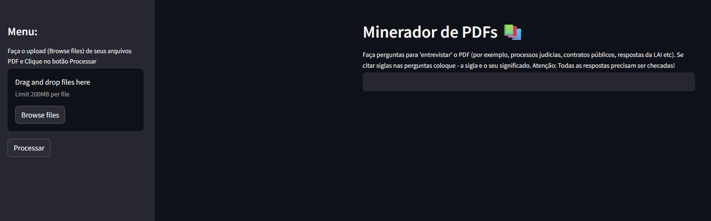

# Minerador de PDFs :unlock:
## Chatbot para Entrevistar PDFs Jornalisticante com Gemini-1.0-pro, Embedding-001 e Streamlit



## Introdução

Este script apresenta um chatbot que utiliza **modelos de linguagem avançados** para entrevistar arquivos PDF com fins jornalísticos. O projeto foi desenvolvido durante a **[Imersão IA 2024](https://www.alura.com.br/imersao-ia-google-gemini)** da Alura e do Google. **[Veja vídeo explicativo](https://www.youtube.com/watch?v=8UFwilLD8DM)**

VERSÃO ON-LINE - VEJA O SITE *[AQUI](https://chatbotdepdfs.streamlit.app/)**

Veja como pegar uma API Key do Gemini aqui **[aqui](https://ai.google.dev/gemini-api/docs/api-key?hl=pt-br)**


## Funcionalidades

- **Entrevista PDFs:** O chatbot pode ser usado para analisar e resumir documentos PDF, como processos judiciais, contratos públicos, pedidos da LAI e outros.
- **Contexto Jornalístico:** O chatbot é treinado com um conjunto de instruções e informações específicas para o contexto jornalístico, garantindo respostas relevantes e precisas.
- **Respostas Abrangentes:** O chatbot fornece resumos abrangentes dos documentos, incluindo informações sobre o tipo de documento, partes envolvidas, principais argumentos e resultados.
- **Segurança e Neutralidade:** O chatbot é configurado com medidas de segurança para evitar a geração de conteúdo prejudicial e garantir a neutralidade nas respostas.
- **Para fins jornalísticos** o modelo Gemini-1.0-pro é utilizado com a temperatura zero porque é a mais indicada para o jornalismo profissional. Temperature = 0 significa que o modelo vai se concentrar em gerar respostas que sejam as mais prováveis ou logicamente corretas com base no texto de entrada. Isso resulta em respostas mais factuais e  determinísticas, mas que podem parecer um pouco mecânicas ou previsíveis.

## Como Funciona

1. **Carregar PDFs:** O usuário carrega os arquivos PDF que deseja analisar.
2. **Processamento de Texto:** O script extrai o texto dos PDFs e o divide em partes menores para processamento.
3. **Criação de Vetor:** O texto é convertido em vetores numéricos usando um modelo de linguagem avançado.
4. **Análise e Resumo:** O chatbot utiliza um modelo de linguagem conversacional para analisar os vetores e gerar resumos informativos e relevantes.
5. **Interação:** O usuário pode interagir com o chatbot fazendo perguntas sobre os documentos e recebendo respostas detalhadas.

## Benefícios

- **Auxílio na Pesquisa Jornalística:** O chatbot pode auxiliar jornalistas na pesquisa e análise de documentos complexos, economizando tempo e esforço.
- **Acesso à Informação:** O chatbot facilita o acesso à informação contida em documentos PDF, tornando-a mais acessível ao público.
- **Transparência e Accountability:** O uso do chatbot na análise de documentos públicos pode contribuir para a transparência e accountability do governo.

## Tecnologias Utilizadas

- **Gemini-1.0-pro:** Modelo de linguagem conversacional do Google AI
- **Embedding-001:** Modelo de incorporação de texto do Google AI
- **Streamlit:** Biblioteca Python para criar interfaces web interativas
- **PyPDF2:** Biblioteca Python para trabalhar com arquivos PDF
- **FAISS:** Biblioteca para indexação e busca de vetores
- **Langchain:** Biblioteca Python para construir cadeias de processamento de linguagem natural. Facilita a construção de aplicações de linguagem assistida por IA. Ela oferece ferramentas para integrar modelos de linguagem, como o GPT e Gemini, em aplicações mais amplas, permitindo que desenvolvedores e pesquisadores criem sistemas complexos de assistentes de linguagem. A biblioteca inclui recursos para gerenciamento de estado, lógica de conversação, e integração com outras APIs e dados externos, tornando-a bastante útil para projetos de pesquisa e desenvolvimento em IA e linguagem natural

## Observações

- O script ainda está em desenvolvimento e pode ser aprimorado com novas funcionalidades e modelos de linguagem.
- É importante lembrar que as respostas do chatbot devem ser sempre verificadas com as fontes originais de informação.


## Orientação extra
- O script app.py utiliza no prompt inicial do chatbot dezenas de orientações de segurança, qualidade, confiabilidade e de orientação de trabalho
- Mas as perguntas feitas pelos usuários e usuárias agora deste chatbot também devem ser as mais detalhadas possíveis para ter melhores resultados
- Ao trabalhar com modelos de linguagem avançados como o Gemini-1.0-pro, a qualidade dos prompts que você fornece é crucial para obter resultados satisfatórios. Prompts detalhados e informativos servem como um guia essencial para o modelo, direcionando-o na direção correta e permitindo que ele utilize todo seu potencial
- Maior Precisão e Relevância: Ao fornecer mais contexto e instruções ao modelo, você aumenta as chances de obter respostas precisas e relevantes ao tópico em questão. Isso porque o modelo tem mais informações para se basear e pode tomar decisões mais conscientes sobre como gerar o texto
- Melhor Compreensão do Objetivo: Prompts detalhados ajudam o modelo a entender melhor o que você espera dele. Isso significa que o modelo poderá gerar respostas mais alinhadas com suas expectativas e necessidades específicas
- Redução da Ambiguidade: Instruções claras e concisas minimizam a ambiguidade e garantem que o modelo não interprete mal suas intenções. Isso evita respostas irrelevantes ou sem sentido
- Controle Criativo Aprimorado: Em tarefas que exigem criatividade, como escrever histórias ou poemas, prompts detalhados podem ser usados para direcionar a criatividade do modelo de acordo com suas preferências. Você pode fornecer detalhes sobre o estilo, o tema, o tom e outros elementos desejados
- Melhor Aproveitamento dos Recursos do Modelo: Ao fornecer mais informações ao modelo, você o ajuda a utilizar seus recursos de forma mais eficiente. Isso pode resultar em respostas mais rápidas e com melhor qualidade

## Dicas para Criar Prompts Detalhados
    Seja específico: Descreva o que você deseja que o modelo faça com o máximo de detalhes possível.
    Forneça contexto: Inclua informações relevantes sobre o tópico em questão, como histórico, fatos importantes ou definições de termos técnicos.
    Use exemplos: Se possível, forneça exemplos de como você gostaria que o modelo respondesse. Isso ajudará o modelo a entender suas expectativas.
    Seja claro e conciso: Evite linguagem ambígua ou frases longas e complexas.
    Adapte à tarefa: Ajuste o nível de detalhamento do prompt de acordo com a tarefa específica que você está realizando.

Lembre-se:

    Prompts detalhados são um investimento que vale a pena, pois permitem que você obtenha melhores resultados do seu modelo de linguagem.
    Com um pouco de esforço e planejamento, você pode criar prompts que guiem o modelo na direção certa e o ajudem a alcançar todo seu potencial.

Exemplos de prompts detalhados:

Tarefa: Resumir um artigo de notícias sobre um novo estudo científico.

Prompt ruim: "Resumir este artigo."

Prompt bom: "Resumir este artigo de notícias sobre um novo estudo científico, focando nos principais resultados e conclusões do estudo. Mencionar os autores do estudo e o nome da revista científica em que foi publicado. Usar linguagem clara e concisa, adequada para um público geral."

Tarefa: Escrever um poema sobre o amor.

Prompt ruim: "Escrever um poema."

Prompt bom: "Escrever um poema sobre o amor, utilizando metáforas e imagens vívidas para expressar os sentimentos de amor e paixão. O poema deve ter no mínimo 10 versos e seguir um esquema de rimas ABAB CDCD EFEF. Usar linguagem poética e evocativa."


# Instruções de Instalação e Execução

## Pré-requisitos

Antes de iniciar, certifique-se de que você possui o Python instalado em seu sistema. Este projeto foi desenvolvido utilizando Python 3.9 ou superior.

## Instalação

Siga estes passos para configurar o ambiente e instalar as bibliotecas necessárias para rodar o `app.py`:

1. **Clone o Repositório:** Primeiramente, clone o repositório do GitHub para o seu computador local utilizando o comando:
   ```bash
   git clone https://github.com/seu-usuario/seu-repositorio.git
   cd seu-repositorio

2. **Crie um Ambiente Virtual (opcional, mas recomendado)**
   ```bash
   python -m venv venv
   Ative o ambiente virtual:
   .\venv\Scripts\activate (Windows)
   source venv/bin/activate (macOS/Linux)
   
3. **Instale as Bibliotecas Necessárias**
    ```bash
   pip install -r requirements.txt

4. **Arquivo .env**
    ```bash
    Não esqueça de ter um arquivo ".env" com sua GOOGLE_API_KEY

5. **Executando o Aplicativo**
    ```bash
   streamlit run app.py
    Isso iniciará o servidor do Streamlit e abrirá automaticamente
    uma janela no navegador padrão apontando para o endereço
    local (geralmente http://localhost:8501), onde o app
    pode ser visualizado e interagido
   

   


## Sobre o Autor

**Reinaldo Chaves** trabalha com jornalismo de dados e investigativo, especializado em temas como transparência pública, dados abertos, meio ambiente e políticas de privacidade de dados. Atualmente, ele está na Associação Brasileira de Jornalismo Investigativo (Abraji) e na Repórter Brasil. Projetos notáveis incluem:
- **[Mapa da Água:](https://github.com/Reporter-Brasil/mapadaagua)** Um projeto finalista nos Sigma Awards de 2023, ligado à Repórter Brasil, envolvendo análise e visualização de dados sobre gestão e qualidade da água no Brasil.
- **[CruzaGrafos](https://www.abraji.org.br/projetos/cruzagrafos)** Associado à Abraji e finalista nos Sigma Awards de 2021, uma ferramenta de jornalismo de dados para investigação de redes e conexões entre pessoas e empresas.
- Estudo sobre **[detecção de discurso de ódio](https://github.com/JournalismAI/attackdetector)** com machine learning no antigo Twitter pela iniciativa JournalismAI.


## Contato

Para mais informações, perguntas ou colaborações, sinta-se à vontade para entrar em contato via e-mail: [reichaves@gmail.com](mailto:reichaves@gmail.com)
